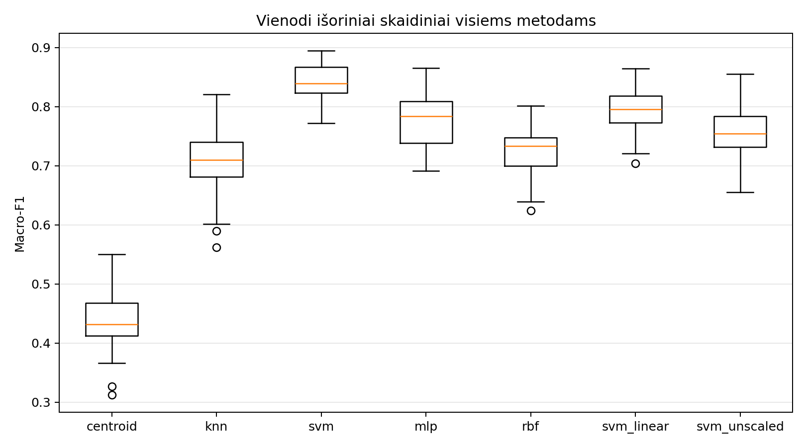
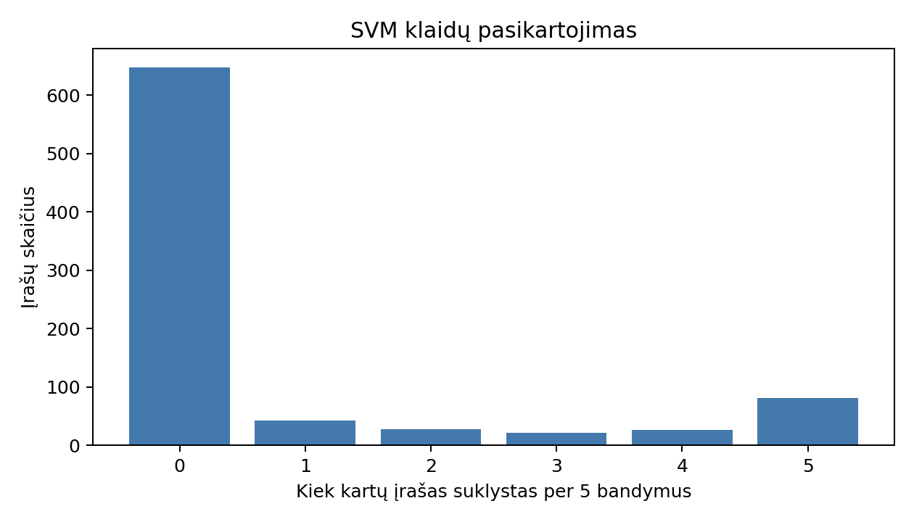
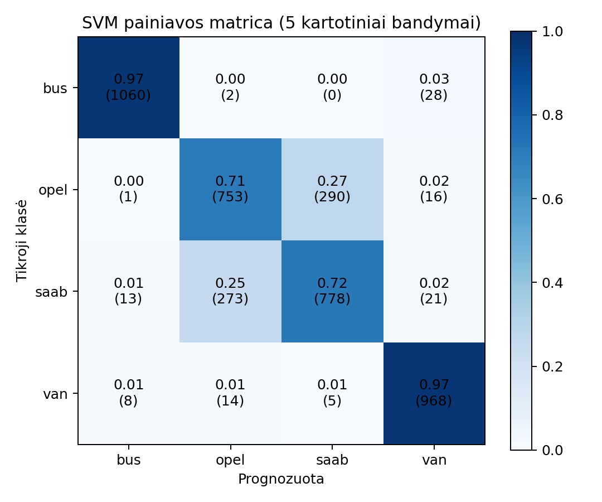
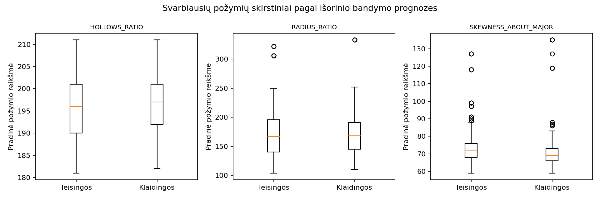

# Transporto priemonių siluetų klasifikavimo egzamino ataskaita

Kirilas Šeršniovas, PEPfm-26

## Duomenys ir protokolas

Naudotas OpenML Vehicle ID 54, 1 versija: 846 įrašai, 18 skaitinių požymių ir keturios klasės. MD5: `fbba18157b188f309d772f9ca4e578f5`. Visi metodai vertinti tais pačiais 5 × 10 stratifikuotais išoriniais skaidiniais; hiperparametrai parinkti penkių dalių vidine CV pagal Macro-F1. Imputavimas ir standartizavimas išmokti tik mokymo dalyse.

## Metodų palyginimas

| Metodas | Macro-F1 vidurkis ± SD | Balanced accuracy vidurkis ± SD | Vidutinis mokymo laikas, s |
|---|---:|---:|---:|
| svm | 0.842 ± 0.031 | 0.843 ± 0.030 | 3.812 |
| svm_linear | 0.794 ± 0.036 | 0.797 ± 0.036 | 2.012 |
| mlp | 0.775 ± 0.047 | 0.781 ± 0.044 | 5.481 |
| svm_unscaled | 0.756 ± 0.040 | 0.765 ± 0.037 | 5.031 |
| rbf | 0.727 ± 0.037 | 0.741 ± 0.034 | 9.524 |
| knn | 0.708 ± 0.053 | 0.714 ± 0.052 | 0.008 |
| centroid | 0.441 ± 0.052 | 0.462 ± 0.047 | 0.007 |

Užregistruota visų septynių metodų išorinių pritaikymų su vidine paieška mokymo trukmė: 21.6 min. Šis skaičius neapima duomenų įkėlimo, diagramų ir atsparumo prognozių laiko.
Atlikta 18951 modelio pritaikymų. Visas mokymas ir diagnostika iki ataskaitos: 26.6 min.; didžiausias pagrindinio proceso RAM: 242.6 MB. Naudotas vienas procesas ir iki keturių skaičiavimo gijų.
Prieš šį pakartotinį eksperimentą dėl 20 000 biudžeto MLP alpha tinklelis sumažintas iki {0,0001; 0,01}, RBF pločio daugikliai iki {0,5; 1}. Tai dokumentuotas koliokviumo plano pakeitimas; ankstesni rezultatai buvo žinomi, todėl naujas paleidimas nėra nepriklausomas išankstinės hipotezės patvirtinimas. SVM ir baseline protokolas nepakeistas.

Prognozavimo trukmė vienam išoriniam bandymo paketui (vidurkis):

- centroid: 2.342 ms; pakete 84–85 įrašai.
- knn: 11.896 ms; pakete 84–85 įrašai.
- mlp: 2.102 ms; pakete 84–85 įrašai.
- rbf: 3.144 ms; pakete 84–85 įrašai.
- svm: 4.964 ms; pakete 84–85 įrašai.
- svm_linear: 2.759 ms; pakete 84–85 įrašai.
- svm_unscaled: 5.721 ms; pakete 84–85 įrašai.

Skaidinių metrikos yra koreliuotos: 50 skaičių nėra 50 nepriklausomų eksperimentų. Painiavos matricoje kiekvienas iš 846 objektų kaip bandymo įrašas pasirodo penkis kartus.

## Iš anksto iškelta SVM hipotezė

Geresnis baseline: **knn**. SVM porinis Macro-F1 skirtumas: **+0.134**; pataisytas 95 % intervalas [+0.097; +0.170]; teigiamų pakartojimų: 5/5. Hipotezė patvirtinta pagal aprašytą kriterijų.

Pagal pirminę metriką pirmauja **svm**. SVM RBF galėjo pasinaudoti netiesine riba ir reguliuojama marža; tikslios priežasties vien iš šio palyginimo įrodyti negalima.

## Ablacija ir atsparumas

- `svm_linear`: Macro-F1 0.794, skirtumas nuo SVM RBF -0.047.
- `svm_unscaled`: Macro-F1 0.756, skirtumas nuo SVM RBF -0.086.

RBF branduolio pranašumas prieš tiesinį SVM šiame rinkinyje dera su netiesinės ribos hipoteze. Ablacija neįrodo, kad tai vienintelė pranašumo priežastis.
Kritimas pašalinus standartizavimą rodo, kad šio rinkinio skirtingi požymių masteliai yra svarbūs SVM.

- SVM, noise 0.05: Macro-F1 0.833, pokytis nuo neperturbuoto rezultato -0.009.
- SVM, noise 0.10: Macro-F1 0.818, pokytis nuo neperturbuoto rezultato -0.024.
- SVM, noise 0.20: Macro-F1 0.765, pokytis nuo neperturbuoto rezultato -0.077.
- SVM, missing 0.05: Macro-F1 0.776, pokytis nuo neperturbuoto rezultato -0.066.
- SVM, missing 0.10: Macro-F1 0.724, pokytis nuo neperturbuoto rezultato -0.118.

Visų pagrindinių metodų Macro-F1 pokytis esant didžiausiam bandytam trikdžiui:

| Metodas | Pradinė reikšmė | Triukšmas 0,20 | Pokytis | Trūksta 10 % | Pokytis |
|---|---:|---:|---:|---:|---:|
| centroid | 0.441 | 0.438 | -0.003 | 0.440 | -0.001 |
| knn | 0.708 | 0.698 | -0.010 | 0.679 | -0.030 |
| svm | 0.842 | 0.765 | -0.077 | 0.724 | -0.118 |
| mlp | 0.775 | 0.740 | -0.035 | 0.711 | -0.064 |
| rbf | 0.727 | 0.712 | -0.014 | 0.688 | -0.039 |

SVM išlieka pirmas ir paslėpus 10 % požymių (0.724 prieš 0.711 artimiausio konkurento), tačiau jo santykinis kritimas yra didžiausias. Praktiniam naudojimui su nepilnais matavimais reikia papildomo nepriklausomo bandymo.

Visi metodai gavo tuos pačius perturbuotus bandymo objektus. Kiekvienas trikdžio lygis kartotas 20 kartų tame pačiame skaidinyje; šie kartojimai nėra nepriklausomos naujos imtys.

Perturbacijos taikytos tik išorinei bandymo daliai; triukšmo mastas apskaičiuotas iš atitinkamos mokymo dalies. Triukšmo ir trūkstamų požymių testai imituoja pasirinktus pažeidimus, tačiau neapima realių kamerų ar naujų transporto priemonių modelių.

## Klaidų analizė

- Tikroji `bus`: 1060/1090 teisingų; dažniausia klaida į `van` (28).
- Tikroji `opel`: 753/1060 teisingų; dažniausia klaida į `saab` (290).
- Tikroji `saab`: 778/1085 teisingų; dažniausia klaida į `opel` (273).
- Tikroji `van`: 968/995 teisingų; dažniausia klaida į `opel` (14).

Iš 846 skirtingų įrašų 647 klasifikuoti teisingai visuose penkiuose bandymuose, o 81 klaidingai visuose penkiuose. Tai padeda atskirti sistemingai sunkius įrašus nuo vieno skaidinio atsitiktinumo.

Didžiausio diagnostinio tarpo klaidingų prognozių pavyzdžiai (pradiniai vaizdai neprieinami):

- Įrašas 815: tikroji `bus`, prognozuota `van`, mažiausias porinis |balas| 2.282.
- Įrašas 297: tikroji `saab`, prognozuota `opel`, mažiausias porinis |balas| 2.166.
- Įrašas 285: tikroji `saab`, prognozuota `opel`, mažiausias porinis |balas| 2.157.
- Įrašas 72: tikroji `opel`, prognozuota `saab`, mažiausias porinis |balas| 1.899.
- Įrašas 148: tikroji `saab`, prognozuota `opel`, mažiausias porinis |balas| 1.899.

Didžiausias vidutinis Macro-F1 kritimas po bandymo požymio permutacijos: `HOLLOWS_RATIO` (0.234), `RADIUS_RATIO` (0.216), `SKEWNESS_ABOUT_MAJOR` (0.171). Tai modelio jautrumo diagnostika, o ne priežastinis požymių poveikio įrodymas.

Nuolat sunkūs įrašai pagal tikrąją klasę: bus 5, opel 49, saab 48, van 5.

Požymių medianos: nuolat sunkūs įrašai (bent 4 klaidos, n=107) ir visada teisingi (n=647).

| Požymis | Sunkūs | Visada teisingi |
|---|---:|---:|
| `HOLLOWS_RATIO` | 197.0 | 196.0 |
| `RADIUS_RATIO` | 166.0 | 166.0 |
| `SKEWNESS_ABOUT_MAJOR` | 70.0 | 72.0 |

Šių trijų požymių medianos panašios, todėl vien jų nepakanka paaiškinti sunkių įrašų. Šis skirstinių palyginimas yra aprašomasis; jis nepagrindžia priežastinės klaidų kilmės.

Šis balas nėra tikimybė. Tie patys įrašai gali kartotis skirtinguose CV pakartojimuose; sąraše jie parodyti po vieną.

## Ribos ir praktinis tinkamumas

OpenML failas neturi patikimų fotografavimo serijų `e2`–`e5` identifikatorių ir pradinių vaizdų. Todėl atsitiktinė stratifikacija gali pervertinti gebėjimą veikti naujame fiziniame modelyje ar naujoje fotografavimo aplinkoje. Autobuso arba furgono supainiojimas su lengvuoju automobiliu gali būti praktiškai reikšmingesnis už Opel ir Saab supainiojimą, tačiau konkreti klaidų kaina nenustatyta. Prieš praktinį diegimą reikėtų nepriklausomo naujų modelių ir kamerų rinkinio, o klaidų kainą nustatyti pagal konkretų naudojimo scenarijų. Šiuo metu sprendimas yra 18 jau išvestų požymių klasifikavimo prototipas.

## Gynimo patikra

Studentas turi paaiškinti `src/models.py::build_pipeline` SVM formulės ryšį su `C` ir `gamma`, paleisti dėstytojo pateiktą nematytą įrašą per `predict.py` ir parodyti mažą pakeitimą. Šios gyvo gynimo dalies ataskaita iš anksto neįrodo.

## Papildoma plano klaidų analizė

Visų 18 požymių teisingų ir klaidingų prognozių minimumai, 5, 25, 50, 75, 95 procentiliai ir maksimumai pateikti `error_feature_distributions.csv`. Grafike parodyti trys pagal permutaciją svarbiausi požymiai. Kiekvienas įrašas vertintas penkis kartus, todėl tai aprašomieji susijusių prognozių skirstiniai, o ne nepriklausomų stebėjimų statistinis testas.

Klaidų dalis prie mokymo skirstinių kraštų:

- Bent vienas kraštinis požymis: 309/2205 (14.0%).
- Visi požymiai tarp 5 ir 95 procentilių: 362/2025 (17.9%).

Kraštai nustatyti pagal atitinkamos mokymo dalies 5 ir 95 procentilius, nenaudojant testo riboms parinkti. Dėl 18 požymių bent vienas kraštinis požymis gali pasitaikyti dažnai; vien šis požymis neįrodo anomalijos.

Klaidų pasiskirstymas pagal pakartojimą:

- Pakartojimas 1: 136/846 (16.1%).
- Pakartojimas 2: 132/846 (15.6%).
- Pakartojimas 3: 128/846 (15.1%).
- Pakartojimas 4: 131/846 (15.5%).
- Pakartojimas 5: 144/846 (17.0%).

Visų kryptinių klasių porų klaidų skaičiai ir dalys pateikti `class_pair_errors.csv`. Po 10 skirtingų įrašų su didžiausiu diagnostiniu tarpu klaidų ir mažiausiu tarpu teisingų prognozių pateikti atitinkamuose CSV.

Požymių trūkumo jautrumas: kiekviename išoriniame teste vienas požymis visiškai paslepiamas, o jo reikšmės užpildomos mokymo medianomis. Tai papildomas diagnostinis bandymas, atskiras nuo atsitiktinių 5 % ir 10 % langelių trūkumo; jo rezultatai nenaudoti modelio atrankai.

- `HOLLOWS_RATIO`: vidutinis Macro-F1 kritimas 0.218 ± 0.050.
- `RADIUS_RATIO`: vidutinis Macro-F1 kritimas 0.166 ± 0.066.
- `SCALED_VARIANCE_MINOR`: vidutinis Macro-F1 kritimas 0.124 ± 0.033.
- `ELONGATEDNESS`: vidutinis Macro-F1 kritimas 0.114 ± 0.045.
- `SKEWNESS_ABOUT_MAJOR`: vidutinis Macro-F1 kritimas 0.112 ± 0.045.

Požymių permutacija ir trūkumas yra skirtingi trikdžiai, todėl jų reitingai nebūtinai sutampa. Koreliuoti požymiai ir klasių sudėties skirtumai riboja priežastines interpretacijas.

## Viso vykdymo ištekliai

Konservatyvi mokymo proceso ir paeiliui paleistų patikros bei ataskaitos procesų RAM viršutinė riba: 426.1 MB. Ji skaičiuojama sudedant mokymo proceso piką ir didesnį iš dviejų nuosekliai vykdomų pagalbinių procesų pikų; tikras bendras pikas gali būti mažesnis.

Nuo mokymo manifesto užregistravimo iki pirmos ataskaitos: 26.8 min. Pradinis duomenų įkėlimas prieš manifestą į šį laiką neįtrauktas.